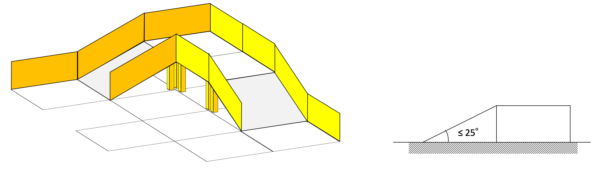
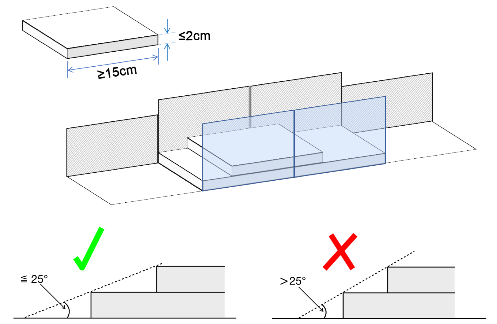
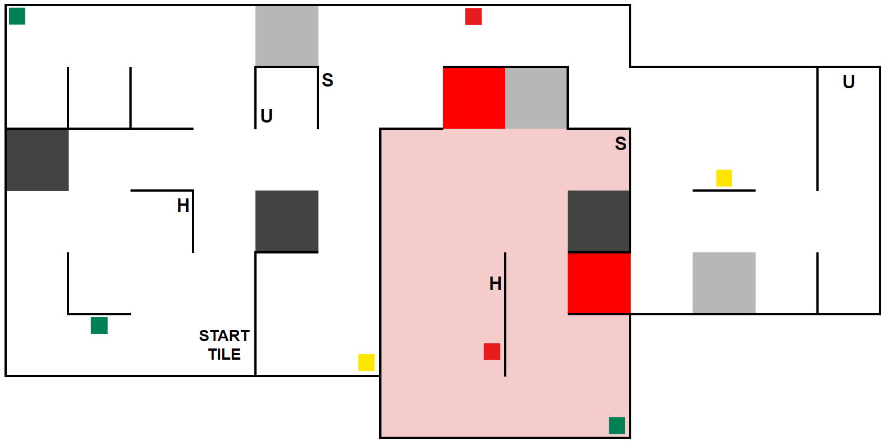
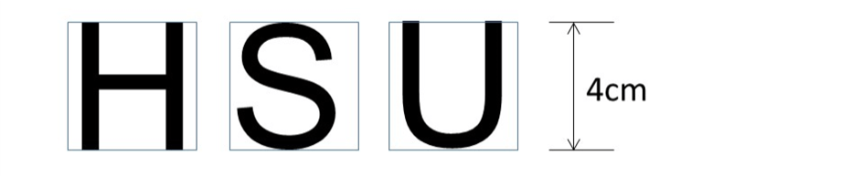

== Field

=== Description

. The field layout will consist of a collection of tiles with a horizontal floor, a perimeter wall, ramps, and walls within the field.

. All tiles are defined as a 30 cm x 30 cm space.

. All walls used to create the maze are at least 15 cm high from any floor or the peaks of stairs, 30 cm in length, and are mounted on the edges of the tiles.

. Tiles will be used as ramps. They will have an incline with a maximum of 25 degrees from the horizontal and are always straight.

. {++Ramps must NOT have a drop-off immediately following a rise section, creating a peak-like structure, or vice versa.++}

[.text-center]

=== Floor

. Floors may be either smooth or textured (like linoleum or carpet) and may have deviations of up to 3 mm in height between the tiles. There may be holes in the floor (approximately 5 mm in diameter) for fastening walls.

. Colored tiles:
.. There will be tiles of different colors on the floor of the maze. The meaning of each color is explained below.
.. Colored tiles will be placed at the start of each game.
.. The organizers will fix colored tiles to the floor, but teams should be prepared for slight movements of these tiles.

. Black tiles in the field represent holes, which the robot must avoid.

. Silver tiles in the field represent checkpoints.

. Blue tiles:
.. Blue tiles in the field represent puddles or other hard-to-traverse terrains.
.. If a robot visits a blue tile, it has to stop for 5 consequent seconds before visiting another tile.

. {++Red tiles in the field represent the entrance of the dangerous zone.++}

. Robots must be designed to navigate under tiles that form bridges over other tiles. Tiles placed above other tiles will be supported by walls. The minimum height (space between the floor and the ceiling) will be 25 cm.

[[path]]
=== Path

. Tiles that lead to the starting tile consistently following the leftmost or rightmost wall are called 'linear tiles'. The tiles that do NOT lead to the starting tile consistently following the leftmost or rightmost wall are called 'floating tiles'.

. Black tiles will affect the determination of tile type (linear or floating) since they can be considered virtual walls.
+
[.text-center]
image::media/path.png[]
+
. Teams must prepare for the pathways to be slightly smaller in dimension (±10% variation on the tile size) than a tile due to the nature of placing walls.

. Pathways for the robot are intended to be of the width of the tile and may open into foyers more expansive than the pathways.

. One tile is the starting tile, where a robot should start and exit the run. It can be located anywhere in the field.

. Walls may be removed, added, or changed just before a scoring run starts to prevent teams from pre-mapping the layout of the fields. Organizers will do their best not to change the maze's length or difficulty when introducing these changes.

=== {~~Speed Bumps, Debris, Obstacles, and Stairs~>Speed Bumps, Obstacles, and Stairs~~}

. Speed bumps are fixed to the floor and have a maximum height of {~~2~>1~~} cm.

. {++Speed bumps are not allowed to be placed on ramps or stairs.++}

. Obstacles:
.. have a minimum height of 15 cm.
.. may consist of any large, heavy items.
.. may be fixed to the floor.
.. may be any shape.

. Organizers may place obstacle either:
.. at least 20 cm from any wall OR
.. touching any wall and at least 20 cm from the opposite edge of the tile and any other obstacles.

. Obstacles that are moved or knocked over must remain where they are moved or fall and will not be reset during the scoring run.

.  The width of the stairs is the same as the path. The maximum height is 2 cm. The length of the top of the stairs is at least 15 cm.

.  The incline of stairs (i.e., the angle of a plate to the horizontal when placed on the stairs) will be less than 25 degrees outside the dangerous zone.

.  {++Stairs may be used to change the level of the floor, similar to a ramp.++}

.  Stairs will be placed between walls.

[.text-center]

=== {++Dangerous Zone++}

. The Dangerous Zone is an area considered more challenging than the rest of the field.

. The Dangerous Zone is marked by a red tile at the entrance and completly surrounded by walls.

. The Dangerous Zone does not block the path for completing the entire map. Therefore, the rest of the field can be completed without entering the Dangerous Zone.

. Speed bumps are allowed to be placed on ramps inside the dangerous zone.

. The debris is not fixed to the floor and has a maximum height of 1 cm inside the dangerous zone.

. The incline of stairs (i.e., the angle of a plate to the horizontal when placed on the stairs) will be less than 30 degrees inside the dangerous zone.

. Speed bumps are fixed to the floor and have a maximum height of 2 cm inside the dangerous zone.

. The start tile will not be inside the Dangerous Zone.

[.text-center]

NOTE: The tiles inside the dangerous zone won't be red (except for the entrance), this is just for illustration purposes.

=== Victims

. There are two types of victims: letter victims and colored victims.

. Victims are located near the floor of the field (located about 7 cm above the floor, see the figure below).
+
[.text-center]
image::media/victim_position.png[]

. Organizers will never locate victims on walls facing {~~black/silver/blue~>black/silver/blue/red~~} tiles, tiles with obstacles/speedbumps/stairs, and ramps.

. There may be objects that resemble victims in appearance but are not victims. This includes but is not limited to letters, symbols or colors other than the ones described on this section. Such objects should not be identified as victims by robots.

. Letter victims are uppercase letters printed on or attached to the wall. They are printed in black, using a sans serif typeface such as 'Arial'. They can be rotated, and their height will be 4 cm. The letters represent the health status of the victim.
.. Harmed victim: H
.. Stable victim: S
.. Unharmed victim: U
+
[.text-center]

. Colored victims are printed on or attached to a wall. Their size will be 16 cm² with no more than 6 cm in either dimension. Three colors are used: red, yellow, and green.

=== Rescue Kits

. A rescue kit represents an essential health package distributed to a victim caught in a natural disaster. It symbolizes tools, medical supplies, or devices used in the rescue process, such as GPS transponders or even something as simple as a light source.

. Because we need to ensure that a rescue kit reaches the victim, it has to stay near the victim after the deployment. For example, it cannot roll away from or bounce away from the victim.

. Each rescue kit must have a minimum size of 1 cm in each dimension and have a minimum volume of 1 cm³ after deployment.

. A robot can only carry a maximum number of 12 rescue kits.

. Each team is responsible for its rescue kit system, including bringing the rescue kits to the competition. The team captain is responsible for loading the rescue kits onto their robot and collecting it from the field with the referee's authorization after the end of the run.

. [[deploy-kit-visible]] Deployment of the rescue kit must be very clear to the referee.

=== Environmental Conditions

. The environmental conditions at a tournament may differ from those at home practice fields. Teams must come prepared to adjust their robots to the conditions at the venue.

. Lighting and magnetic conditions may vary in the rescue field.

. The field may be affected by magnetic fields (e.g., under-floor wiring and metallic objects). Teams should prepare their robots to handle such interference.

. The field may be affected by unexpected lighting interference (e.g., camera flash from spectators). Teams should prepare their robots to handle such interference.

. The RoboCupJunior Rescue Committee will try its best to fasten the walls onto the field floor so that the impact from contact should not affect the robot.

. All measurements in the rules have a tolerance of ±10%.

. Objects detected by the robot will be distinguishable from the environment by their color or shape.
