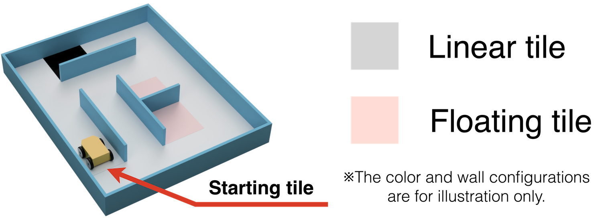
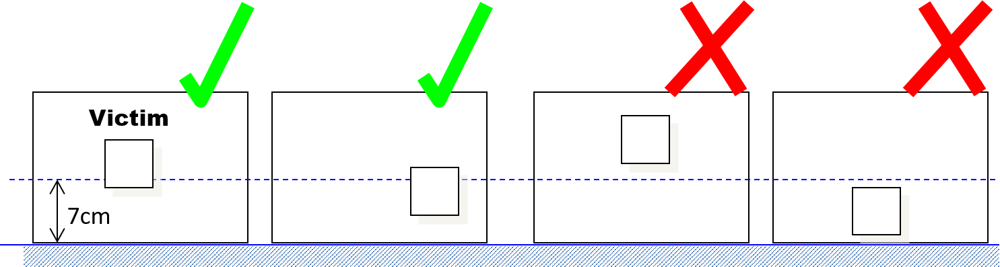

== Field

=== Description

. The field layout will consist of a collection of tiles with a horizontal floor, a perimeter wall, and walls within the field.

. All tiles are defined as 30 cm x 30 cm space.

. All walls used to create the maze are at least 15 cm high from any floor or the peak, 30 cm in length, and are mounted on the edges of the tiles.

. The definition of walls also include the support structure on the ends (e.g. pillars, aluminium profiles, …).

=== Floor

. Floors may be either smooth or textured (like linoleum or carpet) and may have deviations of up to 3 mm in height between the tiles. There may be holes in the floor (approximately 5 mm in diameter) for fastening walls.

. Colored tiles:
.. There will be tiles of different colors on the floor of the maze. The meaning of each color is explained below.
... Black tiles in the field represent holes, which the robot must avoid.
... Silver tiles in the field represent the starting tile and checkpoints.

.. The colored tiles will be placed at the start of each game.
.. The organizers will fix colored tiles to the floor, but teams should be prepared for slight movements of these tiles.

[[path]]
=== Path

. Tiles that lead to the starting tile and checkpoint tiles consistently following the leftmost or rightmost wall are called 'linear tiles'. The tiles that do NOT lead to the starting tile and checkpoint tiles consistently following the leftmost or rightmost wall are called 'floating tiles'.

+
[.text-center]

+
. Black tiles will affect the determination of tile type (linear or floating) since they can be considered virtual walls.

. Teams must prepare for the pathways to be slightly smaller due to the walls not being indefinitely thin. That leads to the pathway between two opposite walls being 28 cm wide.

. Pathways may open into foyers more expansive than the pathways.

. One tile is the starting tile, where a robot should start and exit the run. The starting tile will only be placed along the outer perimeter and must be colored silver.

. Walls may be removed, added, or changed just before a scoring run starts to prevent teams from pre-mapping the layout of the fields. Organizers will do their best not to change the maze’s length or difficulty when introducing these changes.

=== Speed Bumps, Obstacles

. Speed bumps are fixed to the floor and have a maximum height of 1 cm.

. Obstacles: 
.. have a minimum height of 15 cm.
.. may consist of any large, heavy items.
.. may be fixed to the floor.
.. may be any shape.

. Organizers may place obstacles either:
.. at least 20 cm from any wall OR
.. touching any wall and at least 20 cm from the opposite edge of the tile and any other obstacles.

. Obstacles that are moved or knocked over must remain where they are moved or fall and will not be reset during the scoring run.

=== Victims

. There are two victims.  Green victims represent people with mild injuries, while red victims represent people with severe injuries.

. Victims are located on the floor of the field.

. Organizers will never locate victims on black/silver tiles, tiles with obstacles/speedbumps.

. There may be objects that resemble victims in appearance but are not victims. This includes but is not also colors other than the ones described on this section. Such objects should not be identified as victims by robots.

. The victims are printed on or attached to a floor. They are 50mm square in size and placed so that the center of the victim is in the center of the tile.
+
[.text-center]

=== Environmental Conditions

. The environmental conditions at a tournament may differ from those at home practice fields. Teams must come prepared to adjust their robots to the conditions at the venue.

. Lighting and magnetic conditions may vary in the rescue field.

. The field may be affected by magnetic fields (e.g., under-floor wiring and metallic objects). Teams should prepare their robots to handle such interference.

. The field may be affected by unexpected lighting interference (e.g., camera flash from spectators). Teams should prepare their robots to handle such interference.

. The tournament organizer will try its best to fasten the walls onto the field floor so that the impact from contact should not affect the robot.

. All measurements in the rules have a tolerance of ±10%.

. Objects detected by the robot will be distinguishable from the environment by their color or shape.
