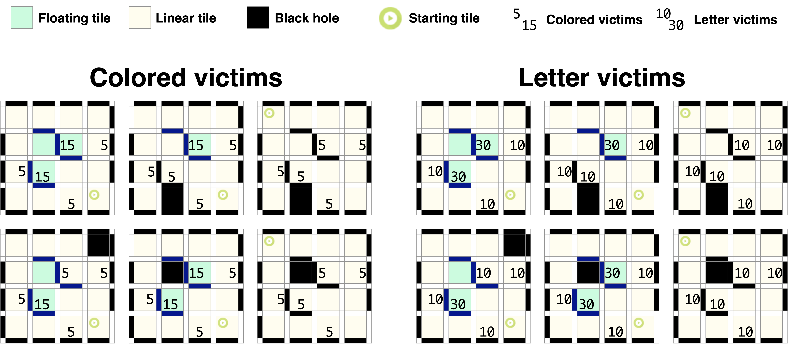

== Play

=== Pre-game Practice

. When possible, teams will have access to practice fields for calibration and testing throughout the competition.

. Whenever there are dedicated independent fields for competition and practice, it is at the organizers' discretion if testing is allowed on the competition fields.

=== Humans

. Teams should designate one of their members as 'captain' and another as 'co-captain'. Only these two team members will be allowed access to the competition fields unless directed by a referee. Only the captain can interact with the robot during a scoring run.

. The captain can move the robot only when they are told to do so by a referee.

. Other team members (and any spectators) within the vicinity of the competition field must stand at least 150 cm away from the field unless directed by a referee.

. No one is allowed to touch the fields intentionally during a scoring run.

. All pre-mapping activities will immediately disqualify the robot for the round. Pre-mapping is the act of humans providing the robot with information about the field (e.g., location of walls, location of {~~black/silver/blue~>black/silver/blue/red~~} tiles, location type of victims, etc.) before the game.

[[start-of-game]]
=== Start of Game

. Each team has a maximum of 8 minutes for a game. The game includes the time for calibration and the scoring run.

. Calibration is defined as taking sensor readings and modifying a robot's program to accommodate such sensor readings. Calibration does not count as pre-mapping.

. The scoring run is defined as the time when the robot is moving autonomously to navigate the field, and the referee will record the scores.

. A game begins at the scheduled starting time, whether or not the team is present or ready. Start times will be posted around the venue.

. Once the game has begun, the robot is not permitted to leave the competition area.

. Teams may calibrate their robot in as many locations as desired on the field, but the clock will continue to run. Robots are not permitted to move on their own while calibrating.

. Before a scoring run begins, the referee will roll a standard 6-sided dice or another method of randomization set by the organizers to determine the location of the black, blue, {++red++} and silver tiles. Organizers will not reveal the position of the black, blue, {++red++} and silver tiles to the team until they are ready to start a scoring run. Referees will ensure the combination of black tile placements in a field layout is 'solvable' before a robot begins a scoring run.

. Before a scoring run begins, the referee can change any walls of the field (see <<path>>).

. Once a team is ready to start a scoring run, the team must notify the referee. To start a scoring run, the robot is placed on the start tile of the course, as indicated by the referee. Once a scoring run has begun, no more calibration is permitted, including changing code/code selection.

. Teams may choose not to calibrate the robot and immediately start the scoring run instead.

. Once the robot starts moving as the scoring run begins, a referee will place the black, blue, {++red++} and silver tiles.

[[run]]
=== Scoring Run

. Modifying the robot during a scoring run is prohibited, which includes remounting parts that have fallen off.

. Any parts the robot loses intentionally or unintentionally will be left on the field until the game ends. Team members and referees cannot move or remove elements from the field during a scoring run.

. Teams cannot give their robot any information about the field. A robot is supposed to recognize the field elements by itself.

. A 'visited tile' means that more than half of the robot is inside the tile when looking from above.

=== Lack of Progress

. A lack of progress occurs when:
.. the team captain declares a lack of progress.
.. a robot visited the black tile. See the definition of visited tile on <<run>>.
.. a robot visits another tile without stopping for 5 consequent seconds after visiting a blue tile. See the definition of visited tile on <<run>>.
.. a robot damages the field.
.. a team member touches the field or their robot without permission from a referee.

. In the event of a lack of progress, the robot must return to the last visited checkpoint (or the start tile if it never reached a checkpoint). The robot can be installed in any direction. For the definition of the visited tile (see <<run>>).

. After a lack of progress, only the LoP procedure explained to the referee before the run start is allowed to be performed (see <<construction>>).

[[scoring]]
=== Scoring
. To successfully identify a victim, the robot must stop within 15 cm of a victim and blink {~~an indicator~>with the specific LED or Display (see <<construction>>) that is cleary~~} visible to the referee for the full 5 seconds while stationary. {++The blink interval (ON: 500ms, OFF: 500ms) must be followed to successfully identify a victim.++}

. Points are rewarded for each Successful Victim Identification in the field.
..	For victims located on a linear tile.
... For colored victims: 5 points
... For letter victims: 10 points
..	On floating tiles
... For colored victims: 15 points
... For letter victims: 30 points

+
[.text-center]

NOTE: The color in the figure is for illustration only. Some tiles change between floating or linear depending on the adjacent black tiles. The field designer must remember this rule when deciding on the location of the black tiles. They can be changed during the run via a dice roll to keep the maximum score consistent.

.  A robot must deploy a rescue kit entirely within 15 cm of the victim to successfully deploy a rescue kit. The deployment point is determined by the location of the rescue kit when the robot moves entirely out of the 15 cm boundary of the victim.

.  No points will be awarded for delivering a rescue kit to a victim that wasn't successfully identified first.

.  10 points are awarded per successful rescue kit deployment. The robot can score the following amount of rescue kits points:
.. Letter victims:
... Harmed (H): two rescue kits per victim. (Maximum points for rescue kit deployment per victim: 20 points.)
... Stable (S): one rescue kit per victim. (Maximum points for rescue kit deployment per victim: 10 points.)
... Unharmed (U): zero rescue kit per victim.
.. Colored victims:
... Red: two rescue kits per victim. (Maximum points for rescue kit deployment per victim: 20 points.)
... Yellow: one rescue kit per victim. (Maximum points for rescue kit deployment per victim: 10 points.)
... Green: zero rescue kits per victim.

. The Reliability Bonus is a non negative number and consists of the number of successful victim identifications (SVI), successful rescue kit deployments (SRD) and a deduction for the total number of Lack of Progresses (LoP) as such:
+
  (RELIABILITY BONUS) = (SVI) × 10 + (SRD) × 10 - (LoP) × 10

. Successful Speed Bump Crossing. For each tile with speed bumps passed, a robot is awarded 5 points.

. Successful Up or Down Ramp Navigation. A robot is awarded 10 points for successfully navigating up or down a ramp (i.e., the robot can score a maximum of 10 points per ramp). The robot has successfully navigated through the ramp when it moves from the bottom to the top tile (or vice-versa) and is entirely within the horizontal tile without toppling over.

. Successful Stair Navigation. A robot is awarded {~~5~>10~~} points for navigating {~~a set of stairs in either direction~>up or down the stairs~~} (i.e., the robot can score a maximum of {~~5~>10~~} points per {~~set of stairs~>direction (up or down)~~}). Successful navigation means the robot moves from the bottom {~~tile on one side of the stairs to the top tile and then onto the bottom tile on the other side of the stairs without assistance~>to the top of the stairs (or vice-versa) and is horizontal.~~}

. Successful Checkpoint Navigation. A robot is awarded 10 points for each visited checkpoint. Refer to <<run>> for definition of visited tile.

. Successful Exit Bonus. A robot is awarded 10 points for each victim successfully identified.
{~~The 'exit bonus' condition is satisfied when the robot returns to the starting tile and stays there for at least 10 seconds to complete the scoring run.~>The 'exit bonus' condition is satisfied when the robot returns to the starting tile. On the starting tile, the robot has to blink (ON: 1s, OFF: 1s) with the same LED or display that is used to identify a victim (see <<construction>>) for at least 10 seconds.~~}

. No duplicate rewards. For example, suppose a robot successfully crosses a tile with speed bumps multiple times. In that case, only one successful speed bump crossing will be rewarded per tile. The same result applies to all other scoring rules.

. Misidentification. If a robot identifies a victim but is outside the 15 cm radius of any victim, 5 points will be deducted. This scenario doesn't apply to delivering the incorrect number of rescue kits to victims. The total points will never go below zero points.

=== End of Game
. A team may elect to stop the game early at any time. In this case, the team captain must indicate the team's desire to terminate the game to the referee. The team will be awarded all points earned up to the call for the end of the game. The referee will stop the time at the end of the game, which will be recorded as the game time.

. The game ends when:
.. the 8 minutes of allowed game time expires
.. the team captain calls the end of the game
.. the robot returns to the start tile and is awarded the exit bonus
