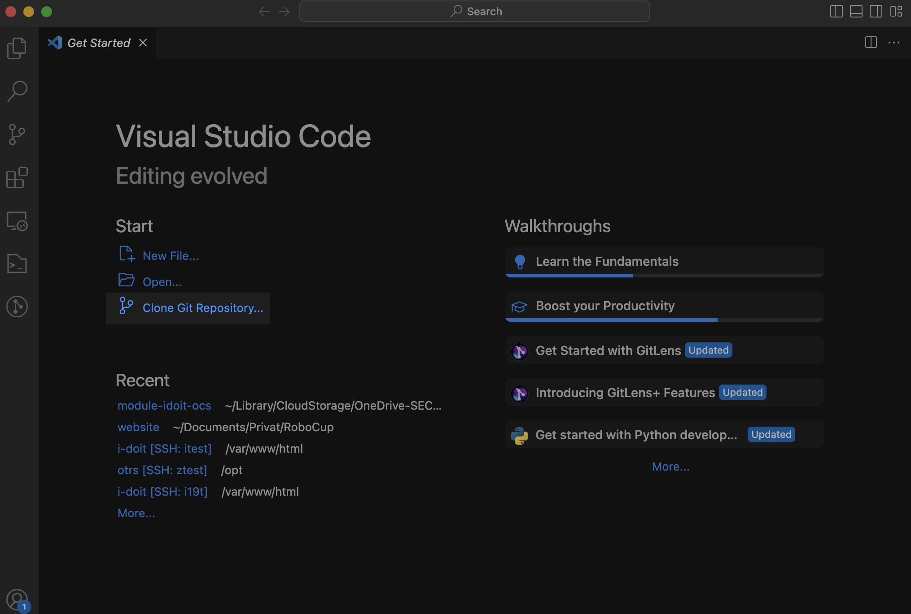
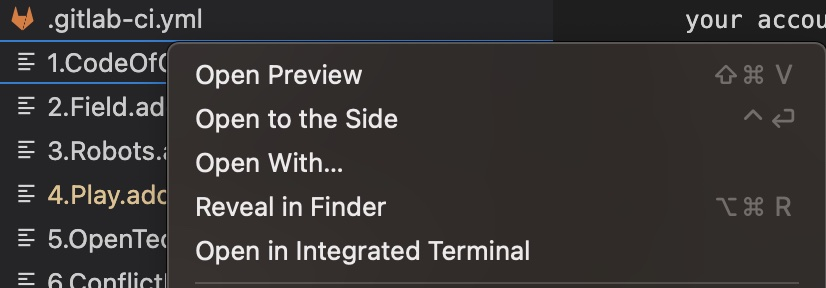
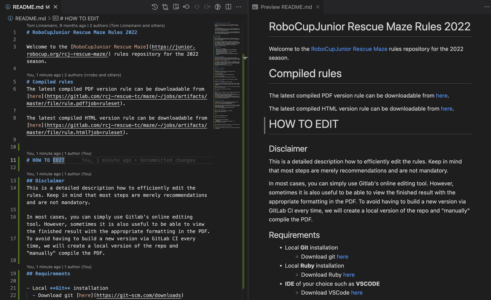

# RoboCupJunior Rescue Maze Rules 2024

Welcome to the [RoboCupJunior Rescue Maze](https://junior.robocup.org/rcj-rescue-maze/) rules repository for the 2024 season.

## Compiled rules
The latest compiled PDF and HTML version of the rule can be downloadable from [here](https://github.com/robocup-junior/rescue-maze-rules/releases/latest).

# HOW TO EDIT

## Disclaimer
This is a detailed description how to efficiently edit the rules. Keep in mind that most steps are merely recommendations and are not mandatory.

In some cases, you can simply use GitHub's online editing tool. However, sometimes it is also useful to be able to view the finished result with the appropriate formatting in the PDF.
To avoid having to build a new version via the Github CI every time, we will create a local version of the repo and "manually" compile the pdf.

## Requirements

- **Git** installation
  - Download git [here](https://git-scm.com/downloads)
- **IDE** of your choice such as **VSCODE**
  - Download VSCode [here](https://code.visualstudio.com/Download)
- **Python3** installation
  - Download Python [here](https://www.python.org/downloads/)
- Compiler for asciidoc **asciidoctor-pdf** (2 options)
  - Using **Docker-Desktop**
    - Download Docker-Desktop [here](https://www.docker.com/products/docker-desktop/)
  - Local **Ruby** installation
    - Download Ruby [here](https://www.ruby-lang.org/de/documentation/installation/)
    - Install asciidoctor-pdf locally with ```gem install asciidoctor-pdf```


## Working with git
For basic information on how to set up your locale git installation and how to do basic tasks with git, read through the [official GitHub documentation](https://docs.github.com/en/get-started/using-git)

To simplify cloning and editing for you, I recommend to store the ssh-key in GitHub. Read [this](https://docs.github.com/en/authentication/connecting-to-github-with-ssh/adding-a-new-ssh-key-to-your-github-account).

## Setup

### Clone the repository

#### Clone via Console
```
# Directory in which you want to download the repo
cd directory_path_to_clone_in

# Clone with ssh-key
git clone git@github.com:robocup-junior/rescue-maze-rules.git

# Clone with credentials
git clone https://github.com/robocup-junior/rescue-maze-rules.git
```

> From now on all examples will refer directly to VSCode

#### Clone with VSCode 


If you use the https-link you will have to enter your account credentials. Both the terminal and VSCode will issue a prompt to do this.

Select the directory to clone to. Git will create a new folder "rescue-maze-rules" with all the files.

Open the newly created folder in VSCode.


## Edit files

### Add Markup for Changes

To make changes to the rules more visible, we added a specific syntax to highlight changes accordingly.
The corresponding markup is as such:  
Additions to the rules - **{++Some Addition++}**  
Changes to existing rules - **{\~~Old rule phrase~>New rule phrase~~}**  
Deletions from the rules - **{--Parts to delete--}**

### Things to pay attention to

#### Don't leave any whitespaces between the markup and the text  
{++ Some Addition ++} <span sytele="color:red">✘</span>  
{++Some Addition++} <span sytele="color:red">**✓**</span>   

#### When deleting entire rules, don't include the bullet point in the change  
{--. Point to delete--} <span sytele="color:red">✘</span>  
. {--Point to delete--} <span sytele="color:red">**✓**</span>  


#### You can't markup changes expanding over a single line
. {--First Rule  
. Second Rule  
. Third Rule--} <span sytele="color:red">✘</span> 

Use a list instead:  
. {--First Rule--},{--Second Rule--},{--Third Rule--} <span sytele="color:red">**✓**</span>

### AsciiDoc  

A big advantage of the local version is the possibility to preview and compile the rule files. For this we first need the VsCode extension 'AsciiDoc'.
For more information on installing VsCode extensions, check out the official [documentation](https://code.visualstudio.com/docs/editor/extension-marketplace).

### AsciiDoc - Preview  
To open the preview either right-click the file and select 'Open preview', or use the corresponding shortcut.   


The preview shows a live view of the ascii-file, in which images and basic formatting like bold font and bullet points are displayed properly.  



## Compile the rules

To actaully see the final result with styled changes, you need to compile the rules as a pdf.  
For this we use the same tools that are used in the Github CI, so the result will be the same.  

### Staging changes

The following script will alter the source adoc-files. If you have made any changes that you want to save before compiling, you should stage the files, so the content doesn't get overwritten.
For this switch to the "Source Control"-Panel and stage all changes in the adoc's.  


### Run the criticmarkup script

The script handles 3 different tasks
1. Replacing the marked up sections with readable and styled text
2. Creating footnotes for each change that describes it e.g. "Added Some rule"
3. Creating a "table of changes" with hyperlinks to all the changes in the rules

```powershell
python3 criticmarkup_to_adoc.py
```

If you want to go back to the state before running the script, you can easily discard all the changes.


### Build the pdf via asciidoctor 
There are two options for compiling the pdf. The first is to use a native asciidoctor-pdf installation. The second is to use docker-desktop.
```powershell
#Build the pdf via native asciidoctor-pdf
asciidoctor-pdf -a pdf-themesdir=pdfstyle -n -a pdf-theme=rescue rule.adoc

#Build with Docker-Desktop
docker run -v $(pwd):/documents asciidoctor/docker-asciidoctor asciidoctor-pdf -a pdf-themesdir=pdfstyle -n -a pdf-theme=rescue rule.adoc

#Build with Docker-Desktop on Windows
docker run -v ${PWD}:/documents asciidoctor/docker-asciidoctor asciidoctor-pdf -a pdf-themesdir=pdfstyle -n -a pdf-theme=rescue rule.adoc
```

These commands can also be found inside of the *.github/workflows/.github-ci.yml*.

Running it will create the file *rule.pdf*.

To view the pdf inside of vscode you can install the extension **'vscode-pdf'**.

## Compile the rules through GitHub CI

The GitHub pipeline is defined in .github/workflows/.github-ci.yml.

To trigger the pipeline, simply push a new tag. There are no branch restrictions, allowing new releases to be built from any branch.

While there aren't specific limitations on tags or branches, we encourage creating new tags only when necessary and following our naming conventions.

> Year-type-\[iteration\]
- Year in format YYYY
- type "draft" or "final"
- iteration as n iteration of the type  

e.g. **2024-draft-1** or **2024-final**

The released rule can be found in the [releases section](https://github.com/robocup-junior/rescue-maze-rules/releases)

If there were any mistakes with the released version simply delete the release and tag and create a new one.

