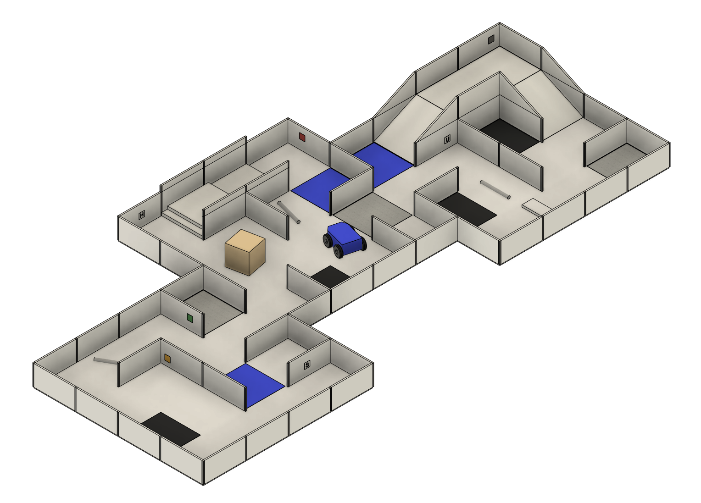

= RoboCupJunior Rescue Maze           Rules 2025
Last update: {docdate}
:url-repo: https://gitlab.com/rcj-rescue-tc/maze
////
ifdef::pdf-style[]
////
:toc: macro
////
endif::[]
ifndef::pdf-style[]
:toc: left
endif::[]
////
:toc-title: Contents
////
:toc-start: 3
:toc-placement: Summary
////
:sectanchors:
:sectlinks:
:xrefstyle: full
:section-refsig: Section
:sectnums:
:sectnumlevels: 3

ifdef::backend-html5[]
++++
<link rel="stylesheet" href="https://use.fontawesome.com/releases/v5.3.1/css/all.css" integrity="sha384-mzrmE5qonljUremFsqc01SB46JvROS7bZs3IO2EmfFsd15uHvIt+Y8vEf7N7fWAU" crossorigin="anonymous">

++++
endif::[]

:icons: font
:numbered:

[.text-right]

[cols="2,10,2", options="header"]
|===
3+^|RoboCupJunior Rescue Committee 2025

|Chair
|Diego Garza Rodriguez 
|Mexico

|
|Stefan Zauper
|Austria

|
|Csaba Aban Jr.
|Hungary

|
|Joann Patiño
|Panama

|
|Ryo Unemoto
|Japan

|
|Alexander Jeddeloh
|Germany

|
|Gonzalo Zabala
|Argentina

|===

[cols="4,3,4,3", options="header"]
|===
2+^|RoboCupJunior Exec 2025
2+^|Trustees representing RoboCupJunior

|Roberto Bonilla
|USA
|Luis José Lopez Lora
|Mexico

|Marek Šuppa
|Slovakia
|Julia Maurer
|USA

|Marco Dankel
|Germany
|
|

|Margaux Edwards
|Australia
|
|

|Rui Baptista
|Portugal
|
|

|Tatiana Pazelli
|Brazil
|
| 

|Tom Linnemann
|Germany
|
|

|===

[discrete]
== Official Resources

[cols="1,1,1",hrows=1, options="header"]
|===
^|RoboCupJunior Official Website
^|RoboCupJunior Official Forum
^|RCJ Rescue Community Website

a|
[link=https://junior.robocup.org/]
image::media/officialsite.jpg[]
[.text-center]
https://junior.robocup.org[https://junior.robocup.org]
a|
[link=https://junior.forum.robocup.org/]
image::media/juniorforum.png[]
[.text-center]
https://junior.forum.robocup.org[https://junior.forum.robocup.org]
a|
[link=https://rescue.rcj.cloud/]
image::media/communitysite.png[SITE,align=center]
[.text-center]
https://rescue.rcj.cloud[https://rescue.rcj.cloud]

|===

WARNING: Corrections and clarifications to the rules may be posted on the forum before updating this rule file. It is the responsibility of the teams to review the forum to have a complete vision of these rules.

<<<

[discrete]
== Before you read the rules

IMPORTANT: Please read through the https://junior.robocup.org/robocupjunior-general-rules/[RoboCupJunior General Rules] before proceeding with these rules, as they are the premise for all rules. The English rules published by the RoboCupJunior Rescue Committee are the only official rules for RoboCupJunior Rescue Maze 2025. The translated versions each regional committee can publish are only referenced information for non-English speakers to understand the rules better. It is the responsibility of the teams to read and understand the official rules.

[discrete]
== Scenario

The land is too dangerous for humans to reach the victims. Your team has been given a difficult task. The robot must be able to carry out a rescue mission in a fully autonomous mode with no human assistance. The robot must be durable and intelligent enough to navigate treacherous terrain with hills, uneven land, and rubble without getting stuck. The robot must search for victims, dispense rescue kits, and signal the position of the victims so the humans can take over. Time and technical skills are essential! Come prepared to be the most successful rescue team.

<<<

[discrete]
== Summary

The robot needs to search through a maze for victims. {++The maze can contain an area which is called "Dangerous Zone". This area is considered more challenging than the rest of the field.++} The robot is not supposed to find the fastest path through the labyrinth; instead, it should explore as much of the maze as possible. The robot will be awarded 5, 10, 15, or 30 points for each colored or letter victim detected, dependent on its location in the field. Suppose the robot can successfully deliver a rescue kit close to a victim. In that case, it will earn an additional 10 points per rescue kit. The number of maximum extra points depends on the type of victim.

* 20 points for harmed letter victims
* 10 points for stable letter victims
*	No additional points for an unharmed letter victim
*	20 points for a red-colored victim
*	10 points for a yellow-colored victim
*	No additional points for a green-colored victim

If the robot is stuck in the maze, it can be restarted at the last visited checkpoint. A reflective floor indicates checkpoints, so the robot can save the position to a map (if it uses a map) in a non-volatile medium and restore it in case of a restart. The robot must also avoid areas with black floors.

If the robot can find its way back to the beginning of the maze after exploring the whole maze, it will receive an exit bonus. The robot will also earn a reliability bonus if the robot can exit the maze with a minimum number of restarts. Suppose the robot can find its way back to the beginning after exploring the maze. In that case, it will receive ten bonus points per identified victim as an exit bonus.

The robot can earn additional points by navigating the following hazards:

*	10 points for going up or down a ramp
*	10 points for each visited checkpoint
*	5 points for passing through each tile with speed bumps
*	{~~5~>10~~} points for navigating a set of stairs

<<<
[discrete]
=== Changes from the 2024 RoboCupJunior Rescue Maze Rules
- <<points-1, Changed 0.4 to 0.6>>
- <<points-2, Changed "0.4 x (ENGINEERING JOURNAL SCORE) / (BEST ENGINEERING JOURNAL SCORE)" to "0.2 x (VIDEO SCORE) / (BEST VIDEO SCORE)">>
- <<points-3, Changed "0.7" to "0.6">>
- <<points-4, Changed 0.1 to "0.2">>
{+-~TOC-CHANGES~-+}

<<<
toc::[]
<<<

[[general-rules]]
include::general-rules/general-rules.adoc[]

include::1.CodeOfConduct.adoc[]

include::2.Field.adoc[]

include::3.Robots.adoc[]

include::4.Play.adoc[]

include::5.Competition.adoc[]

include::6.OpenTechnicalEvaluation.adoc[]

include::7.ConflictResolution.adoc[]

<<<